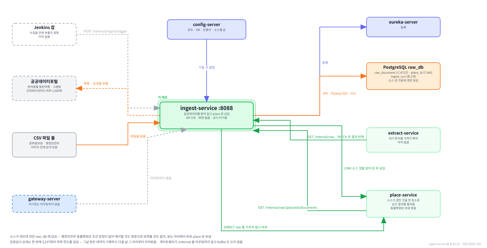

# ingest-service

**함께하개의 수집 서비스입니다.** 공공데이터에서 반려동물과 함께 갈 수 있는 장소를 받아다
**받은 그대로** 담아 둡니다. 담은 것을 해석하는 일은 하지 않습니다.
도메인 서비스 14개 중 **세 번째로 만들어진 서비스**이며, 화면이 하나도 없습니다.

---

**먼저 전체 그림을 보고, 이 레포가 그 안 어디에 있는지 본 뒤 읽습니다.**

**① 전체 구조 — 층으로 본 것.** 위에서 아래로 요청이 내려가고, 어느 층에 무엇이 있는지.


**② 전체 구조 — 서비스끼리 무엇을 주고받는지.** 초록 실선이 `/internal` 호출, Kafka 표가 이벤트, 하늘색 점선이 VPC 경계.


**③ 이 레포를 중심으로.** 직접 연결된 것만 남긴 그림.



> ①② 는 `service-template/docs` 에 있는 것을 가리킵니다. 서비스가 늘어도 그쪽 한 곳만 고칩니다.

<br><br>

---

## 본문 시작

<br><br>

---

## 0. 이 서비스가 하는 일

### 0-1. 한 문장으로

```
공공데이터포털 ──┐
                 ├──▶  ingest  :8088  ──▶  PostgreSQL  raw_db
문화정보원 CSV ──┘                                        │
                                                          └──▶  extract 가 가져가 해석함
```

**받아서 담는 것까지가 전부입니다.** 조건을 읽어 내는 일도, 장소를 합치는 일도 다른 서비스가 합니다.

---

### 0-2. 이 프로젝트가 무엇인지

**함께하개는 반려동물과 함께 갈 수 있는 장소를 찾아 주는 서비스입니다.**

카페에 개를 데려가도 되는지, 데려가도 된다면 목줄이 필요한지 케이지가 필요한지,
크기 제한이 있는지를 미리 알려 줍니다. **가서 못 들어가는 일을 막는 것**이 목적입니다.

그 정보는 공공데이터포털에 흩어져 있습니다. 한국관광공사가 두 벌, 한국문화정보원이 한 벌을 냅니다.
같은 장소가 여러 곳에 나오기도 하고, 어떤 곳은 문장으로만 적혀 있습니다.

```
받아 오기      ingest        ← 이 레포
해석하기       extract       "목줄 착용" 같은 문장에서 조건을 뽑음
합치기         place         여러 소스의 같은 장소를 하나로
판정하기       verdict       "이 개를 데려갈 수 있는가" 를 답함
보여주기       search · user · review …
```

**서비스가 여럿인 이유**는 이 다섯이 서로 아주 다른 일이기 때문입니다.
받아 오는 일은 하루에 몇 번, 보여주는 일은 초당 몇 번 일어납니다.
한 덩어리로 두면 둘 중 하나 때문에 나머지가 멈춥니다.

> 서비스를 나눠 만드는 방식을 **MSA** 라고 부릅니다.
> 이 문서를 읽는 데 그 이름을 알 필요는 없고, **여기가 그중 맨 앞 칸**이라는 것만 알면 됩니다.

---

### 0-3. 먼저 알아 두면 좋은 것 6가지

**① 공공데이터 API 는 하루에 부를 수 있는 횟수가 정해져 있습니다**

> **「오퍼레이션」은 공공데이터포털이 한 서비스 안에서 나눠 둔 기능 하나**를 말합니다.
> 「목록 조회」가 하나, 「상세 조회」가 하나입니다. 허용량이 그 단위로 걸립니다.

```
한국관광공사      오퍼레이션 하나마다 하루 1,000회
                 ⛔한 번 쓰면 자정까지 돌아오지 않음

한 장소의 상세를 받으려면 3번 불러야 함
     동반 조건 · 기본 정보 · 이용 안내가 각각 다른 오퍼레이션임
장소가 1,079곳 → 3,237회 → ⛔하루에 못 끝남
```

**이 한 가지가 이 서비스의 코드 대부분을 설명합니다.** 왜 중간에 멈추고 이어받는지,
왜 바뀐 것만 받으려 애쓰는지, 왜 실패를 네 가지로 나누는지가 전부 여기서 나옵니다.

---

**② 우리는 받은 것을 고치지 않고 그대로 담습니다**

```
공사가 준 것       "acmpyTypeCd": "전구역 동반가능"
우리가 담는 것      "acmpyTypeCd": "전구역 동반가능"     ⛔똑같음
```

빈칸을 채우지도, 이상해 보이는 값을 고치지도 않습니다.
장소 상세 화면에 **「근거문서 원문보기」** 가 있고, 사용자가 그것을 열면 이 값이 그대로 보입니다.
우리가 손댄 값이 거기 뜨면 「원문」이라는 말이 거짓이 됩니다.

---

**③ 담은 것을 해석하는 일은 다른 서비스가 합니다**

```
ingest    "- 목줄 착용\n- 배변봉투 지참"  을 그대로 담음
extract   그 문장을 읽어  { 목줄: 필요, 배변봉투: 필요 }  로 바꿈
```

`extract` 는 아직 만들지 않았습니다. 이 서비스가 담아 둔 17,480건이 그 서비스의 재료입니다.

---

**④ 이 서비스는 화면이 없고 평소에 떠 있지도 않습니다**

```
다른 서비스     브라우저 ──▶ 게이트웨이 ──▶ 서비스        늘 떠 있음
이 서비스       ⛔게이트웨이가 여기로 라우팅하지 않음
                부르는 것은 Jenkins 잡과 extract 뿐
```

경로가 전부 `/internal` 입니다. 브라우저에서 닿지 않고 같은 VPC 안에서만 부를 수 있습니다.
compose 에서도 `app` 이 아니라 **`pipeline` 프로파일**에 있습니다.
프로파일은 「어느 컨테이너를 띄울지 고르는 태그」이고, 평소 조합에 `pipeline` 을 안 넣으면 뜨지 않습니다.

---

**⑤ 소스가 넷인데 여기 담는 것은 셋입니다**

| 소스 | 무엇 | `raw_db` 에 담나 |
|---|---|---|
| `PET_TOUR` | 한국관광공사 반려동물 동반여행 | ✅ |
| `GOCAMPING` | 한국관광공사 고캠핑 | ✅ |
| `CULTURE_CSV` | 한국문화정보원 문화시설 | ✅ |
| `MOIS_VET` | 행정안전부 동물병원 인허가 | ⛔안 담음 |

`MOIS_VET` 은 인허가 대장이라 **동반 조건 문장이 아예 없습니다.** 해석할 것이 없으니
`extract` 가 할 일도 없고, 원문보기에 보여줄 근거도 없습니다. 2단계에서 `place` 로 바로 넘깁니다.

---

**⑥ 「수집 실행」이라는 단위가 있습니다**

```
누가 트리거를 부름  ──▶  실행 하나가 만들어짐  ──▶  받고 담음  ──▶  실행이 끝남
                        ingest_run 표에 한 줄
```

한 번 부를 때마다 `ingest_run` 에 줄이 하나 생깁니다.
몇 건을 받았는지, 몇 건이 바뀌었는지, 어디까지 처리했는지가 그 줄에 남습니다.
**하루에 못 끝난 실행은 「허용량으로 멈춤」으로 마감되고, 다음 실행이 그 자리부터 이어받습니다.**

---

### 0-4. 이 문서를 읽는 순서

| 지금 하려는 일 | 볼 곳 |
|---|---|
| **처음 본다** | [2장](#2-소스-3종이-서로-다릅니다) → [3장](#3-호출-허용량이-이-서비스를-지배합니다) |
| 로컬에서 띄워 본다 | [1장](#1-로컬에서-띄우기) |
| API 를 부른다 | [5장](#5-api-4개) |
| DB 를 본다 | [6장](#6-데이터--raw_db-두-표) |
| 코드를 고친다 | [7장](#7-코드-구조) → [4장](#4-무엇을-어떻게-담는가) |
| 안 도는 것을 고친다 | [11장](#11-막히기-쉬운-자리) |
| 왜 이렇게 만들었는지 | [10장](#10-왜-이렇게-만들었나) |

> **모르는 말이 나오면 [13장 용어](#13-용어)를 먼저 보십시오.**
> `오퍼레이션` · `커서` · `청크` · `증분` · `원문` 이 2장부터 계속 나옵니다.

<br><br>

---

## 1. 로컬에서 띄우기

### 1-1. 무엇이 떠 있어야 하나

```
필수   config-server  :8888     포트 · DB 주소 · 인증키를 여기서 받음
       PostgreSQL     :5432     raw_db

선택   eureka-server  :8761     없어도 뜸.  로그만 지저분해짐
       Kafka · Redis            ⛔안 씀.  안 떠 있어도 됨
```

`infra` 레포에서 띄웁니다.

```bash
cd ../infra
docker compose up -d
docker compose ps
```

`.env` 의 `COMPOSE_PROFILES` 에 최소한 `platform,db` 가 있어야 합니다.

---

### 1-2. 환경변수 3개

IntelliJ 실행 구성의 `Environment variables` 에 `;` 로 이어 넣습니다.

| 이름 | 값 | 없으면 |
|---|---|---|
| `DB_HOST` | `localhost` | `UnknownHostException: ${DB_HOST}` |
| `SERVICE_DB_PASSWORD` | `infra/.env` 의 값 | DB 접속 실패 |
| `INGEST_PUBLIC_DATA_SERVICE_KEY` | 공공데이터포털 **Decoding** 키 | 기동 실패 |

```
DB_HOST=localhost;SERVICE_DB_PASSWORD=여기에infra의값;INGEST_PUBLIC_DATA_SERVICE_KEY=여기에실제키
```

> ⛔**`infra/.env` 는 compose 가 컨테이너에 넣는 값이라 IntelliJ 실행에는 안 읽힙니다.**
> 각자 실행 구성에 따로 넣어야 합니다.

**인증키는 Decoding 쪽입니다.** 포털이 Encoding 과 Decoding 두 벌을 주는데,
Encoding 을 넣으면 코드가 한 번 더 인코딩해서 `SERVICE_KEY_IS_NOT_REGISTERED` 로 거절당합니다.

---

### 1-3. CSV 파일이 있어야 합니다

문화정보원 수집은 바깥을 부르지 않고 **레포에 함께 커밋된 파일**을 읽습니다.

```
ingest-service/data/culture/culture-facility-20250324.csv     30.6MB
```

`git clone` 하면 함께 받아집니다. 없으면 문화정보원 수집이 시작하자마자 죽습니다.

```
출처       공공데이터포털 15111389
원본명      한국문화정보원_전국 반려동물 동반 가능 문화시설 위치 데이터_20250324.csv
크기       30,633,222
sha256     2f88bedff41a8b9f032abd16ce2fb0bc31d91ec28ee559e6e79c2559a2f45928
```

새 판이 나왔는지는 위 체크섬으로 대조합니다. 바꾸는 절차는 [9-5](#9-5-csv-새-판이-나왔을-때)에 있습니다.

---

### 1-4. 띄우고 확인하기

IntelliJ 에서 `IngestApplication` 을 실행합니다.

```powershell
curl.exe "http://localhost:8088/actuator/health"
```

```bash
curl "http://localhost:8088/actuator/health"
```

`{"status":"UP"` 이면 됩니다.

> ⚠**PowerShell 에서는 `curl` 이 아니라 `curl.exe` 입니다.** 그냥 `curl` 은 윈도우가
> `Invoke-WebRequest` 로 바꿔 버려 `-s` 나 `-d` 같은 옵션이 안 먹습니다.

> ⛔**윈도우에서 `Command line is too long` 이 나면** 실행 구성 →
> `Modify options` → `Shorten command line` → **`JAR manifest`** 로 바꿉니다.
> 자바가 뜨기 전에 윈도우 명령줄 길이 제한에 걸리는 것이고 스프링 문제가 아닙니다.

---

### 1-5. 수집을 불러 보기

**⛔누르기 전에 그 소스가 무엇을 쓰는지 보십시오.**

| 소스 | 쓰는 호출 | |
|---|---|---|
| `CULTURE_CSV` | **0회** | ✅얼마든지 돌려도 됨. 파일만 읽음 |
| `GOCAMPING` | 1회 | 하루 1,000 중 하나. 부담 없음 |
| `PET_TOUR` | ⛔목록 11 + 상세 3,237 | 하루치를 통째로 씀. 되돌릴 수 없음 |

**`CULTURE_CSV` 로 시작하십시오.**

```powershell
mkdir C:\Tour_Prj\_scratch -Force
cd C:\Tour_Prj\_scratch

Set-Content -Path trigger.json -Value '{"source":"CULTURE_CSV","runType":"FULL"}' -Encoding utf8 -NoNewline
curl.exe -s -X POST "http://localhost:8088/internal/ingest/trigger" -H "Content-Type: application/json" -d "@trigger.json"
```

```bash
curl -s -X POST "http://localhost:8088/internal/ingest/trigger" \
  -H "Content-Type: application/json" \
  -d '{"source":"CULTURE_CSV","runType":"FULL"}'
```

> ⚠**PowerShell 은 `-d '{"…"}'` 의 따옴표를 먹습니다.** 그래서 파일로 넘깁니다.
> ⛔**그 파일을 레포 안에 만들지 마십시오.** `.gitignore` 가 `.json` 을 막지 않아
> 그대로 추적 대상이 됩니다. 위처럼 레포 밖에 자리를 하나 만들어 쓰십시오.

바로 `202` 와 `runId` 가 돌아오고 수집은 뒤에서 돕니다. 26초쯤 걸립니다.

```powershell
curl.exe "http://localhost:8088/internal/ingest/runs?size=3"
```

```bash
curl "http://localhost:8088/internal/ingest/runs?size=3"
```

`status` 가 `DONE` 이고 `fetchedCount` 가 `13408` 이면 제대로 돈 것입니다.

<br><br>

---

## 2. 소스 3종이 서로 다릅니다

**이 장과 다음 장을 읽지 않으면 코드가 왜 그렇게 생겼는지 설명되지 않습니다.**

### 2-1. 한눈에

| | `PET_TOUR` | `GOCAMPING` | `CULTURE_CSV` |
|---|---|---|---|
| 무엇 | 관광공사 반려동물 동반여행 | 관광공사 고캠핑 | 문화정보원 문화시설 |
| 어디서 | REST API | REST API | ⛔로컬 파일 30.6MB |
| 호출 수 | 목록 11 + 상세 3,237 | **1회** | **0회** |
| 담는 건수 | 1,079 | 2,993 | 13,408 |
| 식별자 | `contentid` | `contentId` | ⛔없음. 만들어 씀 |
| 한 장소에 응답 | 4개 | 1개 | 1행 |
| 증분 | ✅지원 | ⛔미지원 | ⛔미지원 |
| 하루에 끝나나 | ⛔아니오 | 7초 | 26초 |

**호출 수 줄이 이 표의 핵심입니다.** 셋의 성격이 거기서 갈립니다.

---

### 2-2. `PET_TOUR` — 목록을 훑고 장소마다 상세를 셋씩

```
1단계   petTourSyncList2  ──▶  10,149건을 11번에 나눠 받음
          │
          ├── showflag = "1" 인 것만                    표출 중인 장소
          ├── lclsSystm2 ≠ "SH04" 인 것만               ⛔면세점 8,611곳 제외
          └── contentid 로 정렬                          이어받을 때 쓰려고
                    │
                    └──▶  대상 1,079곳

2단계   대상 하나마다 세 번씩 부름
          detailPetTour2   동반 조건        acmpyTypeCd · etcAcmpyInfo …
          detailCommon2    이름 · 주소 · 개요
          detailIntro2     타입별 이용 안내   ⛔contentTypeId 가 필요함
                    │
                    └──▶  1,079 × 3 = 3,237회
```

**1단계는 아무것도 저장하지 않습니다.** 대상만 골라 2단계로 넘깁니다.

저장하면 목록만 담긴 행이 생기는데, 그것이 나중에 상세로 채운 값을 지웁니다.
저장은 원본을 통째로 갈아끼우기 때문입니다.

> ⛔**면세점을 빼는 이유** — `SH04` 가 8,611곳으로 전체의 대부분인데, 공항·시내 면세점이라
> 반려동물과 함께 가는 곳이 아닙니다. 빼지 않으면 상세 호출이 스물여섯 배가 됩니다.

---

### 2-3. `GOCAMPING` — 한 번에 다 옵니다

```
basedList  ──▶  3,115건 · 81필드 · 7.27MB · 1.2초
                     │
                     └── manageSttus = "운영" 인 것만  ──▶  2,993곳
```

**상세를 부르는 경로가 아예 없습니다.** 여든한 개 필드가 목록 응답에 전부 들어 있습니다.

그래서 이 소스에는 이어받을 자리도, 아낄 호출도 없습니다.
하루 1,000회 가운데 **한 번**을 씁니다.

| 담는 값 | 무엇 |
|---|---|
| `animalCmgCl` | `가능` · `가능(소형견)` · `불가능` · 빈 값 |
| `sbrsCl` · `posblFcltyCl` | 부대시설 · 주변 시설. 쉼표로 이어진 여러 값 |
| `intro` · `lineIntro` | 사람이 쓴 소개 문장 |

> ⛔**「불가능」인 곳도 담습니다.** 안 보여주면 사용자가 다른 데서 검색해 헛걸음을 합니다.
> **갈 수 없는 곳을 갈 수 없다고 알리는 것**이 이 서비스가 하려는 일입니다.

---

### 2-4. `CULTURE_CSV` — 바깥을 부르지 않습니다

```
파일을 한 줄씩 읽으며         70,650행
     │
     ├── 전 컬럼이 똑같은 행을 버림      ──▶  23,980
     ├── 담을 분류가 아니면 버림         ──▶  13,436
     └── 같은 곳이 여럿이면 최신만       ──▶  13,408
```

**거르는 판정이 셋인데 셋 다 이유가 다릅니다.**

| 판정 | 무엇이 걸리나 | 왜 |
|---|---|---|
| 전 컬럼 동일 | 46,670행 | 한 동물병원이 마흔 번씩 복제돼 있음. 좌표까지 같음 |
| 분류 | 10,544행 | 동물약국 · 미용실 · 위탁관리. 화면에 그 칸이 없음 |
| 같은 곳의 옛 판 | 56행 | 2022년 판과 2025년 판이 둘 다 남아 있음 |

세 번째가 까다롭습니다. **작성일만 다르고 나머지가 같아** 첫 판정에 안 걸립니다.

```
개인공간 | 충청남도 공주시 반포면 상신리 594-5
    카페 · 위도 36.39024444 · 전화 0507-1303-3484 · 최종작성일 2022-11-30
    카페 · 위도 36.39024444 · 전화 0507-1303-3484 · 최종작성일 2025-03-24
                                                              ⛔이것만 다름
```

버리지 않으면 둘이 같은 식별자라 뒤에 오는 행이 앞을 덮어씁니다.
**어느 판이 남을지가 파일에 적힌 순서에 달립니다.**

---

### 2-5. 셋을 같은 약속으로 묶었습니다

```java
public interface SourceCollector {
    SourceType source();
    void collect(CollectionContext context, Consumer<List<RawDocumentDraft>> chunkSink);
}
```

**셋이 하는 일이 이렇게 다른데도 이 인터페이스 하나로 붙습니다.**

```
받아 온다      REST 를 부르든 파일을 읽든 수집기 안에서 알아서
넘긴다         몇 건씩 모아 chunkSink 에 넣음
```

받는 쪽(`IngestExecutor`)은 **어느 소스인지 모릅니다.** 소스가 늘어도 그쪽은 안 고칩니다.
실제로 문화정보원을 붙일 때 실행기·저장 코드를 한 줄도 건드리지 않았습니다.

> ⚠**클라이언트는 소스마다 따로 둡니다.** `PetTourApiClient` 와 `GoCampingApiClient` 가
> 별개이고 공통 부모가 없습니다. 이유는 [10-1](#10-1-클라이언트를-소스마다-따로-둔-이유)에 있습니다.
<br><br>

---

## 3. 호출 허용량이 이 서비스를 지배합니다

### 3-1. 오퍼레이션마다 하루 1,000회

0장에서 본 오퍼레이션이 실제로 이런 이름입니다.

| 오퍼레이션 | 무엇을 받나 |
|---|---|
| `petTourSyncList2` | 목록. 어떤 장소가 있는지 |
| `detailPetTour2` | 동반 조건. 이 서비스가 가장 필요로 하는 것 |
| `detailCommon2` | 이름 · 주소 · 개요 |
| `detailIntro2` | 이용 안내. 운영 시간 · 휴무일 · 주차 |

```
허용량은 오퍼레이션마다 따로 걸립니다

  petTourSyncList2   1,000  ──  11회만 씀.  남음
  detailPetTour2     1,000  ──  1,079회 필요.  ⛔모자람
  detailCommon2      1,000  ──  1,079회 필요.  ⛔모자람
  detailIntro2       1,000  ──  1,079회 필요.  ⛔모자람
```

**한 계정에 인증키가 하나입니다.** 키를 여러 개 만들어 나눌 수 없습니다.
그래서 관광공사 상세 수집은 **어떻게 해도 하루에 안 끝납니다.**

> 한도를 넘기면 응답 코드 `22` 가 옵니다. 그때부터는 무엇을 불러도 같은 답이 오고
> **자정이 지나야 돌아옵니다.** 실측으로 확인했습니다.

---

### 3-2. 하루에 못 끝나면 다음 날 이어받습니다

```
1일차   1,079곳 중 991곳까지 담고 detailIntro2 가 22 를 맞음
          │
          └──▶  실행이 QUOTA_STOPPED 로 마감됨
                progress 에 "여기까지 했다" 를 적어 둠

2일차   그 실행을 찾아 progress 를 물려받고 그 자리부터
          │
          └──▶  남은 88곳을 담고 DONE
```

**「허용량으로 멈춤」은 실패가 아닙니다.** 대상이 한도보다 많아 한 번에 못 끝내는 것이 정상입니다.

| 마감 상태 | 뜻 | 다음 실행이 이어받나 |
|---|---|---|
| `DONE` | 끝까지 마침 | 이어받을 것이 없음 |
| `QUOTA_STOPPED` | 오늘 몫을 다 씀 | ✅이어받음 |
| `INTERRUPTED` | 연달아 실패해 스스로 접음 | ✅이어받음 |
| `FAILED` | 예상하지 못한 오류 | ⛔안 이어받음 |

`FAILED` 만 안 이어받습니다. **무엇이 잘못됐는지 모르는 상태**라 그 자리를 믿을 수 없습니다.

---

### 3-3. 재개 지점이 무엇을 뜻하나

`ingest_run.progress` 에 오퍼레이션마다 두 값이 들어갑니다.

```json
{
  "petTourSyncList2": { "count": 11,  "cursor": null      },
  "detailPetTour2":   { "count": 992, "cursor": "3533170" },
  "detailCommon2":    { "count": 992, "cursor": "3533170" },
  "detailIntro2":     { "count": 992, "cursor": "3533170" }
}
```

| | 뜻 | 이어받을 때 |
|---|---|---|
| `count` | **이번 실행에서** 몇 번 불렀나 | ⛔0 부터 다시 셈 |
| `cursor` | 어디까지 **저장했나** | ✅그대로 물려받음 |

> **`count` 가 992 인데 담긴 것은 991곳입니다.** 992번째 장소에서 앞의 둘은 받았는데
> 세 번째에서 한도를 맞아 그 장소를 통째로 버렸습니다.
> ⛔**버린 장소의 호출도 셉니다.** 응답을 못 받았어도 허용량은 이미 쓴 것입니다.

**`count` 를 물려받으면 안 됩니다.** 그 값으로 한도를 판단하는데, 어제의 1,000을 그대로 받으면
날이 바뀌어 허용량이 되살아났는데도 첫 호출부터 넘긴 것으로 보고 아무것도 못 합니다.

**`cursor` 는 반드시 물려받아야 합니다.** 없으면 처음부터 다시 받게 되고,
이미 쓴 허용량을 한 번 더 씁니다.

---

**커서는 식별자입니다. 쪽 번호가 아닙니다.**

```
쪽 번호로 이어받으면
    1일차   3쪽까지 봤다고 적음
    2일차   목록에서 항목 하나가 빠짐  ──▶  뒤의 것이 전부 앞 쪽으로 밀림
            4쪽부터 보면  ⛔밀려간 항목을 영영 건너뜀.  아무 신호도 없음

식별자로 이어받으면
    1일차   "3533170 까지 담았다"
    2일차   목록이 흔들려도 그보다 큰 것부터 보면 됨
```

목록이 실제로 흔들립니다. 이틀 사이에 전체가 10,150 → 10,149 로 줄어드는 것을 봤습니다.

**⛔비교는 문자열로 합니다.** 숫자로 바꾸면 눈에는 보기 좋은데,
소스가 숫자가 아닌 식별자를 주기 시작하면 그날 읽기가 통째로 깨집니다.

```
문자열로 보면    "988459"  >  "3533170"      맨 앞 글자가 9 대 3
숫자로 보면       988,459  <  3,533,170

⛔2일차에 남은 88곳의 식별자가 988459 부터였음
   문자열이라 커서보다 뒤로 판정돼 살았고
   숫자였다면 커서보다 앞이라 통째로 건너뛰었을 자리임
```

---

### 3-4. 실패를 네 가지로 가릅니다

**같은 「호출 실패」인데 뒤이어 할 일이 정반대입니다.**

```
허용량 초과 (22)
    오늘은 끝.  받아 둔 것을 저장하고 QUOTA_STOPPED 로 마감
    ⛔다시 부르면 안 됨 — 부르는 것 자체가 낭비

고쳐야 하는 오류
    인증키가 틀렸거나 파라미터가 잘못됨
    ⛔다음 항목도 반드시 같은 결과 — 그 자리에서 접음
    안 접으면 1,079곳을 헛되이 부르고 허용량을 다 씀

일시적인 실패 (05 서버 무응답 · 23 초당 제한 · 타임아웃 · 연결 실패 · 5xx)
    잠시 뒤 다시 부르면 됨.  최대 세 번까지 다시 시도

재시도를 다 쓰고도 실패
    그 장소만 건너뛰고 다음으로 감
    연달아 5건이면 INTERRUPTED 로 스스로 접음
```

⛔**「고쳐야 하는 오류」 목록이 소스마다 다릅니다.**

| | 코드 |
|---|---|
| `PET_TOUR` | 10 · 11 · 12 · 20 · 30 · 31 |
| `GOCAMPING` | 04 · 10 · 12 · 20 · **29** · 30 · 31 &nbsp;&nbsp; ⛔**11 이 없음** |

고캠핑은 게이트웨이를 거쳐서 차단된 주소(29)와 허용되지 않은 요청 방식(04)이 더 있고,
반대로 필수 파라미터 누락(11)이 그쪽 표에 없습니다.
**한쪽을 복사해 쓰면 안 되는 자리**이고, 실제로 시험을 복사하다 틀려서 시험이 잡아냈습니다.

> **모르는 코드는 일시적인 실패로 봅니다.** 다시 시도해 보는 편이 낫고,
> 정말 고쳐야 하는 것이면 재시도를 다 쓰고 실패합니다. 그때 경고가 로그에 남습니다.

**흩어진 실패와 연달아 나는 실패를 가르는 것이 요점입니다.**

한 건이 실패하는 것은 소스 사정입니다. 그것 때문에 그날 받아 둔 것을 통째로 버릴 이유가 없습니다.
그런데 연달아 실패하면 소스가 멈췄거나 우리 요청이 잘못된 것이고,
계속 부르면 남은 허용량을 전부 헛되이 씁니다.

> ⛔**건너뛴 항목도 호출 수는 셉니다.** 응답을 못 받았어도 허용량은 이미 쓴 것입니다.
> 빠뜨리면 다음 실행이 아직 안 썼다고 판단합니다.

---

### 3-5. 증분 — 바뀐 것만 받습니다

**`PET_TOUR` 에만 있습니다.**

```
FULL          1,079곳 전부의 상세를 받음        3,237회
INCREMENTAL   목록의 수정 시각이 늦어진 곳만    바뀐 곳 × 3
```

바뀐 곳이 몇이냐에 따라 갈립니다. **바뀐 것이 없으면 상세를 한 번도 안 부릅니다.**
2026년 9월 9일 실측에서는 전날 전량을 받은 직후라 대상이 0곳이었고,
그날 쓴 상세 호출은 뒤에 나오는 표본 60회뿐이었습니다.

판단은 값 하나로 합니다.

```
목록이 준 modifiedtime  >  우리가 담아 둔 source_modified   ──▶  상세를 부름
같거나 이르면                                              ──▶  건너뜀
담아 둔 것이 없으면                                        ──▶  부름 (새 장소)
어느 한쪽을 못 읽으면                                      ──▶  부름
```

마지막 줄이 중요합니다. **판단할 근거가 없으면 부르는 쪽으로 갑니다.**
놓치는 것보다 허용량을 조금 더 쓰는 편이 낫습니다.

---

**`GOCAMPING` 과 `CULTURE_CSV` 는 증분을 지원하지 않습니다.** 부르면 501 이 옵니다.

```
GOCAMPING       받아 오는 데 1회.  ⛔아낄 것이 없음
CULTURE_CSV     받아 오는 데 0회.  ⛔아낄 것이 없음
```

이미 둘 다 「안 바뀐 것은 저장하지 않는」 방식으로 돕니다.
증분이 더 아끼는 것은 **받아 오는 비용**뿐인데 그 비용이 없습니다.

> ⛔**받아 주고 안에서 전량을 돌게 하지 않았습니다.** 같은 일을 두 이름으로 부르게 되고,
> 코드만 보아서는 그 구별이 되지 않습니다.

---

### 3-6. 그런데 전제가 아직 확인되지 않았습니다

증분 전체가 이 문장 하나에 매달려 있습니다.

> **상세가 바뀌면 목록의 `modifiedtime` 도 바뀐다**

```
전제가 맞으면    바뀐 곳을 빠짐없이 잡음
전제가 틀리면    ⛔조건이 바뀐 것을 영영 놓침
                「동반 가능 → 불가능」이 바뀌었는데 우리는 계속 가능이라고 말함
                ⛔이 서비스가 막으려는 헛걸음을 우리가 만드는 셈
```

**지금 확인할 수 없습니다.** 소스가 실제로 무언가를 고쳐야 관찰되는데 그 시점을 우리가 정할 수 없습니다.

그래서 확인을 기다리지 않고 **전제가 틀렸을 때 그것이 드러나는 길**을 만들어 두었습니다.

```
증분이 끝나면
     └──▶  건너뛴 것 중 가장 오래 안 받은 20곳을 실제로 불러 봄
              └──▶  담아 둔 것과 내용이 같은가?
                       같음    조용히 끝남
                       다름    ⛔전제가 틀렸다는 증거.  실행 기록에 남김
```

비용은 60회(20곳 × 3)이고 상세 허용량 3,000 가운데 2%입니다.

| | |
|---|---|
| 왜 오래된 것부터 | 무작위보다 예측 가능하고, 오래 안 받은 것일수록 소스가 조용히 고쳤을 가능성이 높음 |
| 왜 20건인가 | 한 달이면 600건. 계속 틀리는 소스라면 그 안에 걸림 |
| 언제까지 두나 | ⛔**일시적인 장치.** 몇 주 돌려 한 번도 안 걸리면 `sample-size` 를 0 으로 두어 끔 |

> ⚠**허용량으로 끊긴 실행에서는 표본을 뽑지 않습니다.** 이어받는 날마다 또 60회를 쓰고
> 그만큼 진짜 대상을 덜 받습니다.

<br><br>

---

## 4. 무엇을 어떻게 담는가

한 장소가 `raw_document` 한 줄이 됩니다. 그 줄에 값이 셋 들어갑니다.

```
payload          소스가 준 것 그대로.  ⛔한 글자도 안 고침
display_title    장소 이름.  목록에서 어느 문서인지 알아보는 값
display_body     사람이 읽는 것만 골라 형태를 맞춘 것
content_hash     payload 로 뜬 지문.  다시 해석할지 판단하는 값
```

`display_title` 은 소스마다 자리가 다릅니다.

| 소스 | 어디서 |
|---|---|
| `PET_TOUR` | `list.title` |
| `GOCAMPING` | `facltNm` |
| `CULTURE_CSV` | `시설명` |

---

### 4-1. `payload` — 온 그대로

```json
{
  "list":    { "contentid": "1019041", "title": "와룡공원", "mapx": "126.99…" },
  "petTour": { "acmpyTypeCd": "전구역 동반가능", "etcAcmpyInfo": "- 목줄 착용\n- …" },
  "common":  { "overview": "와룡공원은 삼청근린공원…", "homepage": "<a href=…" },
  "intro":   { "restdate": "연중무휴", "parking": "불가능", "infocenter": "02-…" }
}
```

**`PET_TOUR` 만 열쇠가 넷입니다.** 한 장소에 응답이 넷이기 때문입니다.
나머지 둘은 응답이 하나라 `{ "list": {…} }` 하나뿐입니다.

> ⛔**넷을 하나로 합치지 않습니다.** 합치면 어느 응답에서 온 값인지가 사라집니다.
> `tel` 이 그 예로, 목록과 `detailCommon2` 는 비어 있고 `detailIntro2` 의 `infocenter` 에만 번호가 있습니다.
> 합치면 `tel` 이 빈 것이 소스 성질인지 우리 버그인지 나중에 구분할 수 없습니다.

**빈 문자열은 `null` 로 바꿉니다.** 이것만 유일한 손질입니다.

```
소스가 준 것    "tel": ""
담는 것        "tel": null
```

**판정이 네 칸으로 나뉘기 때문입니다.**

```
가능      조건을 채우면 데려갈 수 있음
조건부    크기 제한 · 케이지 같은 단서가 붙음
불가      데려갈 수 없음
정보 없음  ⛔소스가 아무 말도 안 한 것
```

마지막 칸이 이 손질에 달려 있습니다. `""` 와 `null` 이 섞이면
「값이 없다」와 「값이 빈 문자열이다」를 못 가려 그 칸을 채울 수 없습니다.

> 이 네 칸을 정하는 것은 `verdict` 서비스가 할 일입니다.
> 여기서는 **그 판단이 가능한 형태로 담아 두는 것**까지만 합니다.

> ⚠**문화정보원은 예외입니다.** 그 소스는 값이 없을 때 `"정보없음"` · `"해당없음"` · `"없음"`
> 문자열로 줍니다. **바꾸지 않고 그대로 담습니다.**
> `"없음"` 이 진짜 값일 수 있기 때문입니다. 추가 요금이 `"없음"` 이면
> 정보가 없다는 뜻이 아니라 **요금이 없다는 뜻**입니다.

---

### 4-2. `display_body` — 사람이 읽는 것만

장소 상세의 **「근거문서 원문보기」** 가 이 값을 그대로 보여줍니다.
아래는 고캠핑에서 받은 어느 캠핑장의 실제 값입니다.

```
[반려동물 동반] 불가능

[한 줄 소개] 계곡을 배경으로 펼쳐진 캠핑장
[소개] 주문진 글램핑 오토캠핑장은 강원도 강릉시 주문진읍에 자리 잡고 있다. …

[문의처] 033-642-4241
[운영 기간] 봄,여름,가을,겨울
[예약] 온라인실시간예약

[부대시설] 전기,무선인터넷,장작판매,온수,운동시설
[테마 환경] 봄꽃여행,여름물놀이

[업종] 자동차야영장
[시설 구분] 민간
[관리 형태] 직영
```

**형식 규칙은 소스가 달라도 같습니다.**

| 규칙 | |
|---|---|
| 라벨 | `[동반 유형] 값` 형태. 대괄호 안이 한글 |
| 줄바꿈 | 값에 줄바꿈이 있으면 라벨 다음 줄부터, 없으면 같은 줄 |
| 빈 값 | 라벨째 뺌 |
| 덩어리 | 사이를 빈 줄로 나눔. 통째로 비면 그 덩어리가 사라짐 |
| 순서 | ⛔**동반 조건이 언제나 맨 위** |

**동반 조건을 맨 위에 두는 이유**는 사용자가 이 화면을 여는 목적이 그것이기 때문입니다.
개요가 수백 자여서 위에 두면 근거를 보려고 한참 내려야 합니다.

---

**빼는 것이 세 부류입니다.**

```
기계가 쓰는 값       좌표 · 지역코드 · 분류코드 · 우편번호 · 이미지 주소 · 시각
                    사람이 읽는 문장이 아님

숫자만 든 값         사이트 수 · 화장실 수 · 세계문화유산 여부(0/1)
                    ⛔값이 0 일 때 "없다" 인지 "안 적었다" 인지 구분이 안 됨

⛔개인정보           고캠핑의 mgcDiv — 항목명은 「관리기관구분」인데 실제 값이 사람 이름
```

`mgcDiv` 는 짚어 둘 만합니다.

```
운영 2,993곳에서 고유값 1,147개.  상위값이 전부 사람 이름
    5  김영길      3  김지윤      2  김미숙
    3  서울특별시장  3  연천군청     3  국립자연휴양림관리소
```

이 값이 주소·전화번호와 같은 줄에 놓이면 개인을 식별하게 됩니다.
**원문보기는 관리자 전용이 아니라 사용자가 여는 화면**이라 여기서 뺐습니다.

운영 주체를 알리는 일은 `facltDivNm`(민간·지자체·공립·국립)과 `mangeDivNm`(직영·위탁)이 대신합니다.
채움률도 91%와 100%로 `mgcDiv` 의 40%보다 높습니다.

> ⚠**`payload` 에는 담습니다.** 원문은 온 그대로 보관한다는 방침 때문입니다.
> 대신 원문이 나가는 API 경로를 하나로 좁혀 두었습니다. [10-9](#10-9-원문이-나가는-경로를-하나로-좁힌-이유) 참고.

---

**숫자만 든 값을 이름으로 열거해 빼는 이유**가 있습니다.

```
⛔값이 0 이나 1 이면 뺀다  ──▶  그렇지 않은 필드까지 함께 걸림
                              객실 수가 0 인 행이 있고 그것은 사람이 봐야 할 값임
                              무엇이 빠질지가 그날 받은 데이터에 따라 달라짐

✅이름을 적어 둔다        ──▶  결과가 언제나 같음
```

사전에도 제외 목록에도 없는 이름이 오면 **로그로 알립니다.**
소스가 필드를 늘리면 그것이 조용히 빠지는데, 신호가 없으면 알아챌 방법이 없습니다.

> ✅실제로 값을 했습니다. 고캠핑 81필드 가운데 `tel` 하나만 경고가 떴고,
> 그것은 빼야 할 값이 아니라 **넣었어야 하는 값**이었습니다.

---

### 4-3. `content_hash` — 다시 해석할지 판단하는 값

```
받아 옴  ──▶  payload 를 정규화해 SHA-256  ──▶  담아 둔 해시와 견줌
                                                  같음   ⛔아무것도 안 함
                                                  다름   ✅갈아끼우고 PENDING 으로
```

`PENDING` 이 되면 `extract` 가 그 문서를 다시 해석합니다.
**그 해석이 생성형 모델을 부르는 일이라 한 건마다 돈과 시간이 듭니다.**

**직렬화 규칙 네 가지를 지켜야 합니다.**

```
① 키를 사전순으로 정렬
② 공백 없이 직렬화
③ 빈 문자열을 null 로 바꾼 뒤에 뜰 것
④ ⛔DB 에 넣은 뒤 다시 읽어서 뜨지 말 것    jsonb 가 키 순서를 바꿔 저장함
```

**하나만 어긋나도 아무것도 안 바뀌었는데 전량이 `PENDING` 이 됩니다.**
그러면 `extract` 가 17,480건을 통째로 다시 돕니다.

확인하는 방법은 간단합니다. **같은 수집을 두 번 돌려 두 번째가 `changed=0` 이면 됩니다.**

```
1차   fetched 13408 · changed 13408
2차   fetched 13408 · changed 0        ✅규칙이 지켜지고 있음
```

---

### 4-4. 조립 규칙을 고치면 기존 행이 안 따라옵니다

⛔**이 문서에서 가장 걸리기 쉬운 자리입니다.**

```
display_body 조립 규칙을 고침
     │
     └──▶  payload 는 그대로  ──▶  해시도 그대로
              └──▶  ⛔applyIfChanged 가 false 를 돌려주고 본문을 안 갈아끼움
                       증상이 "코드를 고쳤는데 화면이 그대로"
                       ⛔오류가 아니라서 원인이 안 드러남
```

실제로 밟았습니다. 고캠핑 조립에 `[문의처]` 를 더했는데 재실행해도 안 붙었습니다.

**고치는 법은 지우고 다시 받는 것입니다.**

```sql
DELETE FROM raw_document WHERE source = 'GOCAMPING';
```

그다음 다시 수집합니다. `GOCAMPING` 은 1회, `CULTURE_CSV` 는 0회라 부담이 없습니다.

> ⛔**`PET_TOUR` 는 지우면 안 됩니다.** 상세 3,237회를 다시 써야 하고 그것은 나흘치입니다.
> 그 소스의 조립 규칙을 고칠 일이 생기면 재조립 경로부터 만들어야 합니다. 아직 없습니다.

<br><br>

---

## 5. API 4개

**전부 `/internal` 입니다.** 게이트웨이가 라우팅하지 않아 브라우저에서 닿지 않습니다.

⛔**토큰도 헤더도 필요 없습니다.** 공통 모듈이 `/internal` 을 인증 없이 열어 두고,
실질적인 방어는 게이트웨이와 보안그룹이 맡습니다. 같은 VPC 안에서만 닿기 때문입니다.

| | 경로 | 누가 부르나 |
|---|---|---|
| 1 | `POST /internal/ingest/trigger` | Jenkins 잡 · 사람 |
| 2 | `GET /internal/ingest/runs` | 관리자 화면 |
| 3 | `GET /internal/raw` | `extract` |
| 4 | `PATCH /internal/raw/status` | `extract` |

응답은 전부 공통 형태로 감싸집니다.

```json
{ "code": "SUCCESS", "message": "…", "data": { … }, "traceId": "6aa1…" }
```

---

### 5-1. `POST /internal/ingest/trigger` — 수집을 시작

```json
요청   { "source": "PET_TOUR", "runType": "FULL" }
응답   202   { "runId": "01a085f7-aab1-7159-8c78-1bb15ac15286" }
```

| 값 | 넣을 수 있는 것 |
|---|---|
| `source` | `PET_TOUR` · `GOCAMPING` · `CULTURE_CSV` |
| `runType` | `FULL` · `INCREMENTAL` |

**바로 202 를 돌려주고 수집은 뒤에서 돕니다.** 관광공사 전량은 이틀이 걸려 기다리게 할 수 없습니다.

| 이런 때 | 응답 |
|---|---|
| 같은 소스가 이미 돌고 있음 | `409` `INGEST_ALREADY_RUNNING` |
| 그 소스에 수집기가 없음 | `501` `COLLECTOR_NOT_REGISTERED` |
| `GOCAMPING`·`CULTURE_CSV` 에 `INCREMENTAL` | `501` `RUN_TYPE_NOT_SUPPORTED` |

> ⛔**같은 소스를 두 번 부르면 거절합니다.** 나란히 돌면 같은 허용량을 두 배로 쓰고
> 둘 다 한도에 못 미쳐 멈춰, 어느 쪽도 끝내지 못한 채 그날 몫이 사라집니다.
> 조회로 한 번 막고 DB 유일 인덱스가 한 번 더 막습니다.

---

### 5-2. `GET /internal/ingest/runs` — 실행 이력

```
GET /internal/ingest/runs?source=PET_TOUR&size=20
```

| 파라미터 | 기본값 | |
|---|---|---|
| `source` | 없음 | 안 주면 전부. 소스가 넷이라 섞이면 읽기 나쁨 |
| `size` | 20 | 200 을 넘으면 200 으로 맞춰 줌 |

```json
{ "runs": [
    { "id": "01a0856f-…",
      "source": "PET_TOUR", "runType": "INCREMENTAL", "status": "DONE",
      "startedAt": "2026-09-09T20:39:56", "finishedAt": "2026-09-09T20:40:06",
      "fetchedCount": 0, "changedCount": 0,
      "progress": { "detailIntro2": { "count": 20, "cursor": null }, … },
      "errorMessage": null } ] }
```

**`changedCount` 와 `progress` 가 이 화면의 핵심입니다.**
감지는 스케줄이 하고 실행은 사람이 승인한다는 방침이라, 사람이 이 둘을 보고 다음 실행을 부를지 정합니다.

> ⚠**`errorMessage` 는 이름과 달리 오류가 아닌 것도 담습니다.**
> 건너뛴 항목 목록, 허용량으로 멈춘 오퍼레이션 이름, 표본 검증 결과가 여기로 옵니다.

위 예시는 증분 실행이라 `fetchedCount` 가 0인데 `count` 는 20입니다.
**바뀐 곳이 없어 상세를 한 번도 안 불렀고, 그 20회는 전부 표본 검증이 쓴 것입니다.**

---

### 5-3. `GET /internal/raw` — 처리 대상 가져가기

```
GET /internal/raw?status=PENDING&size=100
```

```json
{ "total": 17480,
  "documents": [
    { "id": "01a082a9-…", "source": "PET_TOUR", "sourceId": "1019041",
      "payload": { "list": {…}, "petTour": {…}, "common": {…}, "intro": {…} },
      "contentHash": "74ed7dd2…", "sourceModified": "2025-04-17T09:21:52" } ] }
```

| | |
|---|---|
| `status` | ⛔필수. `PENDING` · `DONE` · `FAILED` 중 하나 |
| `size` | 기본 100. 500 을 넘으면 500 으로 맞춰 줌 |
| `total` | 그 상태인 문서가 모두 몇 건인지. 몇 번 더 부를지 판단하는 값 |
| `payload` | ⛔문자열이 아니라 객체. 받는 쪽이 두 번 파싱하지 않게 |

`extract` 는 `PENDING` 만 씁니다. 나머지 둘은 사람이 들여다볼 때 쓰는 값이고,
`FAILED` 는 부분 인덱스를 안 타서 조금 느립니다.

**⛔쪽 번호를 받지 않습니다.** 언제나 가장 오래된 것부터 줍니다.

```
쪽 번호로 나누면
    0쪽 100건을 처리  ──▶  그것들이 대기 목록에서 빠짐
    1쪽을 부름       ──▶  원래 200번째였던 것이 100번째로 밀려옴
                          ⛔100~199번째를 통째로 건너뜀.  로그에도 안 남음
```

처리하면 그것들이 목록에서 빠지고 다음이 올라옵니다.
**할 일을 가져가는 것**이지 목록을 훑는 것이 아니라고 보면 이 모양이 자연스럽습니다.

> ⛔**표시용 제목과 본문은 안 나갑니다.** `extract` 는 원문에서 조건을 뽑지
> 표시용 본문을 보지 않습니다. 17,480건을 100건씩 나눠 주는데 안 쓰는 필드가 실리면 응답만 커집니다.

---

### 5-4. `PATCH /internal/raw/status` — 처리 결과 되돌려 쓰기

```json
요청   { "done": ["01a082a9-1f74-…", "01a082a8-fba2-…"], "failed": ["01a082a8-ce15-…"] }
응답   200   { "updated": 3 }
```

**묶어서 받습니다.** `extract` 가 100건을 가져가 처리하므로 되돌려 쓰는 것도 100건입니다.

| 이런 때 | 응답 |
|---|---|
| 없는 식별자가 하나라도 섞임 | `400` `RAW_DOCUMENT_NOT_FOUND` ⛔**전체를 거절** |
| 같은 식별자가 `done` 과 `failed` 에 함께 | `400` `RAW_DOCUMENT_STATUS_CONFLICT` |
| 목록 원소에 `null` | `400` `VALIDATION_FAILED` |

**없는 식별자가 있으면 전체를 거절하는 이유**는, 방금 우리에게 받아 간 것을 되돌려 주는 것인데
없다는 것은 무언가 어긋난 것이기 때문입니다.
조용히 건너뛰면 그 문서가 영영 대기로 남아 **목록 맨 앞을 막습니다.**

> ✅전부 바뀌거나 전부 안 바뀝니다. 진짜 식별자와 가짜를 섞어 보내면
> 진짜 쪽도 안 바뀌는 것을 실물로 확인했습니다.

**실패도 반드시 표시해야 합니다.** 대기로 남겨 두면 그것이 계속 맨 앞에 와 뒤가 나가지 못합니다.

---

### 5-5. 에러 코드

| 코드 | HTTP | 언제 |
|---|---|---|
| `INGEST_ALREADY_RUNNING` | 409 | 같은 소스가 이미 도는 중 |
| `COLLECTOR_NOT_REGISTERED` | 501 | 그 소스의 수집기가 없음 |
| `RUN_TYPE_NOT_SUPPORTED` | 501 | 그 소스가 증분을 지원하지 않음 |
| `INGEST_RUN_NOT_FOUND` | 404 | 실행 기록을 못 찾음 |
| `SOURCE_API_FAILED` | 502 | 재시도를 다 쓰고도 소스 호출이 실패 |
| `SOURCE_FILE_NOT_READABLE` | 500 | CSV 를 못 읽음. 경로나 배포 문제 |
| `SOURCE_FILE_MALFORMED` | 500 | CSV 컬럼 수가 다름 |
| `RAW_DOCUMENT_NOT_FOUND` | 400 | 없는 식별자로 상태를 바꾸려 함 |
| `RAW_DOCUMENT_STATUS_CONFLICT` | 400 | 같은 문서가 완료와 실패에 함께 |
| `RAW_DOCUMENT_NOT_ALLOWED` | 500 | `MOIS_VET` 을 `raw_document` 에 담으려 함 |

> ⚠**허용량 초과와 「고쳐야 하는 오류」는 여기 없습니다.** 둘 다 수집 중에만 나는 내부 신호라
> HTTP 응답으로 나가지 않습니다. 실행 기록에 상태로 남습니다.

<br><br>

---

## 6. 데이터 — `raw_db` 두 표

### 6-1. 한눈에

```
raw_document     받아 온 것 하나가 한 줄        17,480줄
ingest_run       수집을 한 번 부른 기록          부를 때마다 한 줄
```

이 서비스가 `raw_db` 를 소유합니다. **다른 서비스는 이 DB 에 직접 붙지 않습니다.**
`extract` 도 API 로만 가져갑니다.

---

### 6-2. `raw_document`

| 컬럼 | 타입 | |
|---|---|---|
| `id` | uuid | UUIDv7. 시간 순서를 담음 |
| `source` | varchar(20) | 3종. `MOIS_VET` 은 여기 안 옴 |
| `source_id` | varchar(100) | 소스가 준 식별자 |
| `place_id` | uuid | ⛔지금은 전부 비어 있음. `place` 가 채울 자리 |
| `payload` | jsonb | 소스 응답 원본 |
| `display_title` | varchar(200) | 장소 이름 |
| `display_body` | text | 원문보기가 보여주는 것 |
| `content_hash` | varchar(64) | SHA-256 |
| `source_modified` | timestamp | 소스가 알려준 수정 시각 |
| `fetched_at` | timestamp | 우리가 받아 온 시각 |
| `status` | varchar(12) | ⛔`extract` 의 처리 상태. `PENDING` · `DONE` · `FAILED` |

`created_at` 등 감사 컬럼 6개가 더 있습니다. 배치가 만드는 행이라 `created_by` 에 `ingest-batch` 가 들어갑니다.

---

**`source_id` 가 소스마다 다릅니다.**

| 소스 | 값 | |
|---|---|---|
| `PET_TOUR` | `contentid` | 전부 소문자 |
| `GOCAMPING` | `contentId` | ⛔대문자 I |
| `CULTURE_CSV` | `시설명\|지번주소` | ⛔식별자 컬럼이 없어 만들어 씀 |

문화정보원은 31컬럼이 전부 내용이고 식별자가 하나도 없습니다.
그래서 이름과 주소를 이어 만듭니다. 실측으로 고른 것입니다.

| 후보 | 고유값 | 겹치는 키 | 최대 길이 |
|---|---|---|---|
| 시설명만 | 12,278 | ⛔506개 | 29 |
| **시설명 + 지번주소** | **13,408** | 28개 | 52 |
| 시설명 + 도로명주소 | 13,406 | 30개 | 50 |
| 시설명 + 위도 + 경도 | 13,408 | 28개 | 52 |

> ⛔**행 번호를 쓰면 안 됩니다.** 파일이 갱신되면 순서가 바뀌어
> 같은 번호가 다른 장소를 가리키고, 그러면 엉뚱한 행을 덮어씁니다.

---

**인덱스가 셋입니다.**

```sql
UNIQUE (source, source_id)              재수집은 INSERT 가 아니라 UPDATE
INDEX  (place_id)                       원문보기가 장소로 찾음  (2단계)
INDEX  (id) WHERE status = 'PENDING'    ⛔부분 인덱스
```

세 번째가 부분 인덱스입니다. 수집이 끝나면 대부분 `DONE` 이라 `PENDING` 이 소수인데,
조건을 걸어 두면 **완료된 행이 아무리 쌓여도 인덱스가 커지지 않습니다.**

---

### 6-3. `ingest_run`

| 컬럼 | |
|---|---|
| `source` | ⛔4종. `MOIS_VET` 도 실행은 함 |
| `run_type` | `FULL` · `INCREMENTAL` |
| `status` | `RUNNING` · `DONE` · `FAILED` · `QUOTA_STOPPED` · `INTERRUPTED` |
| `fetched_count` · `changed_count` | 받은 건수 · 실제로 바뀐 건수 |
| `progress` | jsonb. 오퍼레이션별 호출 수와 재개 지점 |
| `started_at` · `finished_at` | 시작 · 마감 시각 |
| `error_message` | 사람이 봐야 할 문구 |

> ⚠**이 표에는 감사 컬럼 6개가 없습니다.** `raw_document` 와 달리 공통 부모를 안 물려받습니다.
> 누가 만들었는지가 이미 `source` 와 `started_at` 에 담겨 있어 더 적을 것이 없습니다.

```sql
UNIQUE (source) WHERE status = 'RUNNING'
```

**같은 소스가 나란히 도는 것을 DB 가 막습니다.**
트리거에서 조회로 한 번 거르지만, 두 요청이 같은 순간에 들어오면 둘 다 통과합니다.

> ⚠**앱을 중간에 끄면 `RUNNING` 이 남아 그 소스가 막힙니다.**
> 푸는 법은 [11-3](#11-3-그-소스가-이미-돌고-있다고-나올-때)에 있습니다.

---

### 6-4. 마이그레이션

```
db/migration/common/    V1 · V2      common jar 안에 있음.  outbox · processed_event
db/migration/service/   V20 · V21    이 레포.  raw_document · ingest_run
```

**둘이 형제 경로입니다.** 하나가 다른 하나의 하위면 Flyway 가 한쪽을 버립니다.

`V1` 과 `V2` 는 공통 모듈이 모든 서비스에 넣어 주는 표입니다.
이벤트를 안전하게 주고받으려고 두는 것인데, ⛔**이 서비스는 이벤트를 쓰지 않아
그 표가 생기기만 하고 언제나 비어 있습니다.** 이유는 [10-17](#10-17-kafka-를-안-쓰는-이유) 에 있습니다.

`V21` 은 `ingest_run` 의 부분 유일 인덱스 하나뿐입니다.
`V20` 에서 빠뜨린 것이 아니라, 동시 트리거를 막아야 한다는 것이 그 뒤에 드러나 따로 더한 것입니다.

<br><br>

---

## 7. 코드 구조

### 7-1. 4계층

```
presentation     controller · request              밖에서 들어오는 것
     │
application      service · dto/output · support    흐름을 엮음
     │
domain           model · repository(약속) · provider · enums · exception
     │
infrastructure   persistence(구현) · provider/external · provider/file · config
```

**`domain` 이 무엇도 의존하지 않는 것이 규칙입니다.**
`RawDocumentRepository` 는 `domain` 에서 「무엇을 할 수 있는지」만 적고,
`infrastructure` 가 JPA 로 「어떻게」를 정합니다.

---

### 7-2. 수집이 도는 사슬

```
InternalIngestController
     │
     ├──▶  IngestTriggerService   @Transactional     실행을 만들고 runId 를 돌려줌
     │
     └──▶  IngestExecutor         @Async             ⛔트랜잭션 없음
                │
                ├──▶  SourceCollector.collect(...)   소스마다 다른 구현
                │          │
                │          └──▶  chunkSink.accept(20건)
                │                     │
                │                     └──▶  ChunkWriter.write   @Transactional
                │
                ├──▶  PetTourSampleVerifier.verify   증분일 때만
                │
                └──▶  ChunkWriter.complete / stopByQuota / interrupt / fail
```

**셋으로 나눈 것이 설계입니다.**

```
한 클래스에 두면
    @Async 가 조용히 같은 스레드에서 돎  ──▶  트리거 응답이 이틀 막힘
    @Transactional 도 청크마다 안 열림  ──▶  실행 전체가 한 트랜잭션
```

스프링이 프록시로 이 애노테이션들을 붙이는데, **같은 객체 안에서 자기 메서드를 부르면 프록시를 안 지납니다.**
컨트롤러가 `startRun` 과 `execute` 를 차례로 부르는 것도 같은 이유입니다.

---

### 7-3. 클래스가 무엇을 하나

| 클래스 | |
|---|---|
| `IngestTriggerService` | 실행을 만듦. 중복·미지원을 여기서 거름 |
| `IngestExecutor` | 수집 루프. 예외를 받아 마감 상태를 정함 |
| `ChunkWriter` | 청크 저장 + 진행 기록. 유일하게 DB 에 씀 |
| `IngestQueryService` | 조회 둘 |
| `RawDocumentStatusService` | 상태 묶음 갱신 |
| `PetTourSampleVerifier` | 증분 전제를 표본으로 확인 |
| `JsonNormalizer` | 정규화 직렬화 + 해시 |
| `SourceCollector` 구현 3개 | 소스마다 받아 오는 방법 |
| `~DisplayBodyAssembler` 3개 | 소스마다 표시용 본문을 조립 |

**수집기와 클라이언트는 소스마다 따로입니다.**

```
external/   PetTourApiClient · PetTourCollector · PetTourDisplayBodyAssembler
            GoCampingApiClient · GoCampingCollector · GoCampingDisplayBodyAssembler
file/       CultureCsvReader · CultureCsvCollector · CultureDisplayBodyAssembler
```

`external` 은 바깥을 부르는 것, `file` 은 파일을 읽는 것입니다. 성격이 달라 폴더를 갈랐습니다.

---

### 7-4. 시험 125개

| | 무엇을 |
|---|---|
| 클라이언트 | 오류를 어떻게 가르는지. ⛔**실제 HTTP 서버를 띄워** 확인 |
| 수집기 3종 | 필터 · 재개 지점 · 청크 · 증분 판단 |
| 조립기 3종 | 라벨 순서 · 빈 값 · 제외 목록 |
| 조회 · 상태 갱신 | 언제나 첫 쪽인지 · 부분 반영이 안 생기는지 |
| 검증기 | 표본이 실행 결과를 안 바꾸는지 |
| 정렬 | ⛔**PostgreSQL 컨테이너를 띄워** 확인 |

```bash
./gradlew clean build
```

⚠**빌드에 컨테이너가 뜹니다.** Docker 가 켜져 있어야 하고 30초쯤 더 걸립니다.

**두 곳에서 실물을 띄웁니다.** 흉내로는 못 잡는 것이 있기 때문입니다.

```
클라이언트   상태 코드와 본문이 함께 와야 재현되는 문제가 있음
            JDK 에 들어 있는 HttpServer 를 씀.  의존성이 안 늘어남

정렬        정렬이 저장소 메서드 이름에 있어
            부르는 쪽을 아무리 시험해도 이름에서 빠진 것을 알 수 없음
```

<br><br>

---

## 8. 설정값

### 8-1. 이 레포에는 거의 없습니다

```yaml
# src/main/resources/application.yml — 이게 전부입니다
spring:
  application:
    name: ingest-service
  config:
    import: optional:configserver:http://${CONFIG_HOST:localhost}:8888
  profiles:
    default: local
```

나머지는 `config` 저장소에서 내려옵니다. **네 겹으로 쌓여 뒤엣것이 앞엣것을 이깁니다.**

```
1  application.yml            서비스 전부에 공통      로깅 · 감사 · Flyway 규칙
2  ingest-service.yml         이 서비스에 공통        포트 8088 · raw_db · app.ingest
3  application-{env}.yml      환경에 공통             local · dev · prod.  주소만 갈림
4  ingest-service-{env}.yml   서비스 × 환경           지금은 없음
```

**local 과 dev 를 가르는 것은 「어디서 도느냐」입니다.**
IntelliJ 로 띄우면 `localhost:5432` 를, 컨테이너로 띄우면 `postgres:5432` 를 봅니다.

---

### 8-2. `app.ingest`

```yaml
app:
  ingest:
    # 소스가 달라도 같은 값
    chunk-size: 20
    call-interval-ms: 0
    max-retries: 3
    retry-backoff-ms: 1000
    max-consecutive-failures: 5

    pet-tour:
      base-url: https://apis.data.go.kr/B551011/KorPetTourService2
      service-key: ${INGEST_PUBLIC_DATA_SERVICE_KEY}
      list-page-size: 1000
      sample-size: 20

    gocamping:
      base-url: https://apis.data.go.kr/B551011/GoCamping
      service-key: ${INGEST_PUBLIC_DATA_SERVICE_KEY}
      list-page-size: 3200

    culture:
      file-path: data/culture/culture-facility-20250324.csv
```

| 값 | 무엇 | 왜 이 숫자인가 |
|---|---|---|
| `chunk-size` | 한 트랜잭션에 저장할 건수 | 도중에 죽었을 때 잃는 호출이 20회. 100 이면 100회를 버림 |
| `call-interval-ms` | 호출 사이에 쉬는 시간 | 3,237회를 쉬지 않고 불렀는데 재시도 로그가 한 번도 안 떠 0 |
| `max-retries` | 일시적인 실패에 다시 시도하는 횟수 | 최초 1회 + 재시도 3회 = 최대 4번 부름 |
| `retry-backoff-ms` | 기다리는 시간 | 시도마다 배로. 1초 → 2초 → 4초 |
| `max-consecutive-failures` | 연달아 실패하면 접는 기준 | 5건. 그 위는 소스가 멈춘 것으로 봄 |
| `pet-tour.list-page-size` | 목록을 한 번에 몇 건씩 | 1,000 이면 11회. 실측 0.5초 · 684KB |
| `pet-tour.sample-size` | 표본으로 확인할 곳 수 | 60회 = 상세 허용량의 2%. ⛔몇 주 뒤 0 으로 끌 것 |
| `gocamping.list-page-size` | 같음 | 3,200 이면 전량 3,115건이 한 번에. 7.27MB · 1.2초 |
| `culture.file-path` | CSV 자리 | 상대경로. 컨테이너는 작업 디렉터리가 `/app` |

**⛔인증키 환경변수 이름에 소스가 안 들어갑니다.** 포털이 계정마다 키를 하나만 주기 때문입니다.
기상청·집중률도 같은 계정이라 소스 이름을 붙이면 그때 또 같은 고민을 하게 됩니다.

---

### 8-3. ⛔테스트 리소스에 사본이 필요합니다

```yaml
# src/test/resources/application.yml
app:
  ingest:
    chunk-size: 100
    call-interval-ms: 0
    max-retries: 0
    retry-backoff-ms: 1000
    max-consecutive-failures: 5
    pet-tour:
      base-url: http://localhost
      service-key: test-only
      list-page-size: 100
      # 이 시험들은 표본을 돌리지 않음
      sample-size: 0
    gocamping:
      base-url: http://localhost
      service-key: test-only
      list-page-size: 100
    culture:
      # 이 시험은 파일을 실제로 읽지 않음, 값이 비면 바인딩이 실패하므로 자리만 채움
      file-path: build/tmp/test-culture.csv
```

**`src/main` 것을 병합하지 않고 통째로 가립니다.** 테스트 클래스패스에서 그쪽이 앞서고
`classpath:/application.yml` 은 첫 매치만 씁니다.

그래서 `app.ingest` 블록을 여기에도 적어야 합니다. 안 적으면 검증이 걸린 값 때문에 기동이 실패합니다.

> ⚠**설정을 더할 때 이 파일도 함께 고쳐야 합니다.** 잊으면 빌드가 깨지는데
> 증상이 `app.ingest.culture 설정이 필요합니다` 라 원인은 바로 드러납니다.

<br><br>

---

## 9. 운영

### 9-1. 무엇을 보고 있나

```powershell
curl.exe "http://localhost:8088/internal/ingest/runs?size=5"
```

```bash
curl "http://localhost:8088/internal/ingest/runs?size=5"
```

| 볼 것 | 정상 | 이상 |
|---|---|---|
| `status` | `DONE` · `QUOTA_STOPPED` | `FAILED` 가 이어지면 원인을 봐야 함 |
| `changedCount` | 0 이면 안 바뀐 것 | 매번 전량이면 ⛔직렬화가 흔들리는 것 |
| `progress` 의 `count` | 허용량을 얼마나 썼나 | 1,000 에 가까우면 오늘은 끝 |
| `errorMessage` | `null` | 건너뜀 · 표본 결과가 여기 |

---

### 9-2. 수집을 언제 부르나

**스케줄러가 코드에 없습니다.** Jenkins 잡이 트리거를 부릅니다.

```
코드에 두면    개발 중에 켜져 있는 줄 모르고 허용량이 소모됨
              ⛔되돌릴 수 없는 자원이라 그날 몫이 사라짐
```

소스마다 부르는 방식이 다릅니다.

| 소스 | `runType` | 얼마나 자주 |
|---|---|---|
| `PET_TOUR` | `INCREMENTAL` | 매일. 전량이 필요하면 사람이 `FULL` 로 |
| `GOCAMPING` | `FULL` | 매일. 1회라 부담이 없음 |
| `CULTURE_CSV` | `FULL` | 파일을 바꿨을 때만 |

> ⛔**`GOCAMPING` 과 `CULTURE_CSV` 에 `INCREMENTAL` 을 주면 501 로 거절합니다.**
> Jenkins 잡을 만들 때 이 예외를 기억해야 합니다.

⬜**그 Jenkins 잡이 아직 없습니다.** 지금은 사람이 손으로 트리거를 부릅니다.
레포의 `Jenkinsfile` 은 빌드·배포 파이프라인이라 이것과 별개입니다.

⬜**주기적으로 전량을 다시 받는 장치는 아직 없습니다.** 증분에는 누적 오차가 있습니다.
며칠에 한 번이 적당한지는 [3-6](#3-6-그런데-전제가-아직-확인되지-않았습니다)의 표본이 몇 주 돌면
근거가 생깁니다. 그때 정합니다.

---

### 9-3. 허용량이 떨어졌을 때

```
증상   실행이 QUOTA_STOPPED 로 마감됨
      errorMessage 에 "일일 호출 허용량 초과: detailIntro2"
```

**할 일이 없습니다.** 자정이 지나면 되살아나고, 다음 실행이 그 자리부터 이어받습니다.

오늘 얼마나 썼는지 봅니다. `infra` 폴더에서 부릅니다.

```powershell
docker compose exec -T postgres psql -U pawtrail -d raw_db -c "SELECT started_at::date, status, progress FROM ingest_run WHERE source='PET_TOUR' ORDER BY started_at DESC LIMIT 3;"
```

```bash
docker compose exec -T postgres psql -U pawtrail -d raw_db \
  -c "SELECT started_at::date, status, progress FROM ingest_run WHERE source='PET_TOUR' ORDER BY started_at DESC LIMIT 3;"
```

> ⚠**급하면 다른 계정의 키로 바꿔 끼울 수 있습니다.** 환경변수만 갈면 되고 코드는 안 건드립니다.
> 다만 그렇게 하면 「자정에 되살아난다」를 확인할 기회를 놓칩니다.

---

### 9-4. 그 소스가 이미 돌고 있다고 나올 때

앱을 중간에 끄면 `RUNNING` 이 남습니다. **유일 인덱스의 대가입니다.**

`infra` 폴더에서 그대로 부르면 됩니다.

```powershell
docker compose exec -T postgres psql -U pawtrail -d raw_db -c "UPDATE ingest_run SET status='FAILED', finished_at=now(), error_message='수동 중단' WHERE status='RUNNING';"
```

```bash
docker compose exec -T postgres psql -U pawtrail -d raw_db \
  -c "UPDATE ingest_run SET status='FAILED', finished_at=now(), error_message='수동 중단' WHERE status='RUNNING';"
```

⬜자동으로 치우는 장치는 아직 없습니다. 실제로 얼마나 자주 겪는지 보고 정하기로 했습니다.

---

### 9-5. CSV 새 판이 나왔을 때

```
① 포털에서 받음        data.go.kr 15111389 → 파일데이터 → 다운로드
② 체크섬 대조          같으면 메타데이터만 바뀐 것.  할 일 없음
③ 다르면 파일을 교체    data/culture/culture-facility-{새날짜}.csv
④ 설정의 날짜를 고침    app.ingest.culture.file-path
⑤ 전수 실측을 다시      건수 · 중복 · 분포가 달라질 수 있음
⑥ 이미지를 다시 구움
```

```powershell
Get-FileHash .\data\culture\culture-facility-20250324.csv -Algorithm SHA256
```

```bash
shasum -a 256 data/culture/culture-facility-20250324.csv
```

⚠**파일명을 ASCII 로 둡니다.** 원본 이름에 한글이 들어가면 Docker 의 `COPY` 와
Jenkins 가 경로를 다루는 자리에서 로케일에 따라 갈립니다.

---

### 9-6. 표본 결과를 어떻게 읽나

```
어긋남 없음     errorMessage 가 null.  로그에 "확인=20건 어긋남 없음"
어긋남 있음     ⛔"표본 검증: 20건 중 3건이 목록 시각은 그대로인데 상세가 달라짐 (1019041, …)"
```

**어긋남이 나오면 증분의 전제가 틀렸다는 뜻입니다.** 그때 할 일은 셋입니다.

```
① 그 장소들을 직접 확인   포털에서 modifiedtime 과 상세를 대조
② 판단 기준을 다시 정함   modifiedtime 만으로는 부족하다는 결론이 나면
③ 그동안은 FULL 로       증분을 잠시 멈추고 전량으로 돌림
```

몇 주 돌려 한 번도 안 나오면 `sample-size` 를 0 으로 두어 끕니다.

---

### 9-7. 이미지를 굽고 올리기

⛔**`docker build` 로 구우면 안 됩니다.** 윈도우에서 구우면 amd64 하나짜리가 되어
Apple Silicon 에서 컨테이너가 하나도 안 뜹니다. 실제로 겪었습니다.

```powershell
docker login ghcr.io
.\gradlew clean build
docker buildx build --platform linux/amd64,linux/arm64 -t ghcr.io/paw-trail/ingest-service:latest --push .
docker buildx imagetools inspect ghcr.io/paw-trail/ingest-service:latest
```

```bash
docker login ghcr.io
./gradlew clean build
docker buildx build --platform linux/amd64,linux/arm64 -t ghcr.io/paw-trail/ingest-service:latest --push .
docker buildx imagetools inspect ghcr.io/paw-trail/ingest-service:latest
```

| | |
|---|---|
| `--push` | ⛔빼면 안 됨. 멀티아치 이미지는 로컬에 담을 수 없음 |
| 확인 | `linux/amd64` 와 `linux/arm64` 가 둘 다 나와야 함 |
| `unknown/unknown` | 빌드 증명이라 정상 |
| `docker login` | GitHub 개인 토큰이 필요합니다. `write:packages` 권한 |

⛔**구운 뒤 패키지를 Public 으로 바꿔야 합니다.** 비공개로 두면 팀원이 이미지를 받으려고
`docker login` 을 해야 하고, 「받아서 바로 띄운다」가 깨집니다.
저장소 공개 여부와 이미지 공개 여부는 별개입니다. 이미지에는 컴파일된 결과물만 있고
비밀값은 전부 환경변수로 들어갑니다.

**이미지에 CSV 가 함께 들어갑니다.** 30.6MB 커지지만, 없으면 수집이 파일을 못 읽고 죽습니다.
배포 노드에 파일을 따로 올리는 절차를 두면 그것이 잊히는 순간 배포가 깨집니다.

---

### 9-8. compose 로 띄우기

**`app` 이 아니라 `pipeline` 프로파일입니다.**

```bash
cd ../infra
docker compose --profile infra --profile platform --profile db --profile pipeline up -d
```

```
.env 에 넣어 두려면
  COMPOSE_PROFILES=infra,platform,db,tools,pipeline
```

> ⛔**`--profile` 을 명령에 붙이면 `.env` 값이 대체됩니다.** 더해지지 않습니다.
> 한 번만 다르게 띄우려면 위처럼 전부 나열해야 합니다.

**평소 조합에는 넣지 않는 편이 낫습니다.** 배치라 늘 떠 있을 이유가 없습니다.

<br><br>

---

## 10. 왜 이렇게 만들었나

### 10-1. 클라이언트를 소스마다 따로 둔 이유

```
겹치는 것    재시도 루프 · 인증키 인코딩          40줄쯤
갈리는 것    응답 파싱 · 오류 코드 · 오퍼레이션    나머지 전부
```

40줄을 함께 쓰려고 상속 구조로 바꾸면 이미 검증을 마친 코드를 건드려야 합니다.
그 코드는 상세를 3,237회 실제로 부르며 확인한 것이고, 다시 확인하려면 **허용량을 또 써야 합니다.**

되돌릴 수 없는 자원을 리팩터링에 쓰는 셈이라 하지 않았습니다.
**공통화는 세 번째 HTTP 소스가 생길 때** 판단하는 편이 쉽습니다. 그때 무엇이 실제로 공통인지 드러납니다.

---

### 10-2. 목록을 훑는 단계가 저장을 안 하는 이유

```
저장하면        목록만 담긴 행이 생김
                 └──▶  ⛔상세로 채워 둔 값을 지움 (저장은 원본을 통째로 갈아끼움)

저장 안 하면    지우는 경로가 아예 없음
                도중에 멈춰도 되돌릴 것이 없음
                목록 크기를 저장 단위와 따로 잡을 수 있음
```

세 번째가 덤으로 따라왔습니다. 목록을 1,000건씩 받아 11회로 줄이면서
저장은 20건씩 하는 것이 이 구조라서 가능합니다.

**증분에서도 값을 합니다.** 1단계가 저장을 안 하니 매일 판단을 다시 해도 비용이 없습니다.

---

### 10-3. 커서를 쪽 번호가 아니라 식별자로 둔 이유

목록이 날마다 흔들립니다. 이틀 사이에 10,150 → 10,149 로 줄어드는 것을 봤습니다.

```
항목 하나가 빠지면  ──▶  그 뒤가 전부 앞 쪽으로 밀림
                        쪽 번호로 이어받으면 밀려간 것을 영영 건너뜀
                        ⛔아무 신호 없이 일어남
```

식별자로 정렬해 두면 목록이 흔들려도 이어받는 자리가 정확합니다.

---

### 10-4. 커서를 안 두는 소스가 있는 이유

`GOCAMPING` 과 `CULTURE_CSV` 는 `cursor` 가 `null` 입니다.

```
기록해도 읽을 경로가 없음
    저장 도중에 죽으면 FAILED 인데
    FAILED 는 재개 지점을 안 물려받음
         └──▶  ⛔아무도 안 읽는 값이 실행 기록에 남음
                  다음 사람이 "이걸 보고 이어받나" 하고 헷갈림
```

다시 받는 비용도 각각 1회와 0회라 아낄 것이 없습니다.

---

### 10-5. 실패를 네 가지로 가른 이유

**같은 「호출 실패」인데 뒤이어 할 일이 정반대이기 때문입니다.**

가르지 않으면 인증키가 만료됐을 때 그것이 「한 건이 실패했다」로 보입니다.
연속 실패 한도가 있어 결국 멈추기는 하지만, 그때까지 몇 건을 헛되이 부르고
실행 상태도 `INTERRUPTED` 로 남습니다. 그것은 「우리가 상황을 보고 접었다」는 뜻이라
다음 실행이 재개 지점을 물려받는데, **인증키를 안 고쳤다면 같은 자리에서 또 죽습니다.**

---

### 10-6. 원문을 안 고치는 이유

**「근거문서 원문보기」가 이 서비스의 존재 이유입니다.**

우리 판정이 틀렸을 때 사용자가 근거를 직접 볼 수 있어야 합니다.
그 화면에 우리가 손댄 값이 뜨면 「원문」이라는 말이 거짓이 됩니다.

```
소스가 스스로 어긋나는 것도 그대로 둡니다

  chkpet 이 "동반 불가" 인데  acmpyTypeCd 는 "전구역 동반가능"
       └──▶  ⛔한쪽을 지우지 않음
                소스 안에서 조건이 어긋나는 것을 찾아 알리는 것이
                이 프로젝트가 하려는 일이기 때문
```

---

### 10-7. 표시용 본문에서 관리자 이름을 뺀 이유

`payload` 에는 담고 `display_body` 에서만 뺐습니다. **성격이 다르기 때문입니다.**

```
payload         보관.  원문 방침이 적용됨
display_body    사용자가 여는 화면.  개인 이름이 뜨면 안 됨
```

이 프로젝트는 사업이 아니라 공모전 실증용입니다.
개인정보 처리방침도 동의 절차도 없는 상태로 개인 이름이 섞인 값 1,147개를 화면에 띄우는 것은
**대비가 없는 쪽**입니다.

그리고 그 값이 쓸모도 없습니다. 이름뿐이고 연락처가 아니라 그 사람에게 전화할 방법이 없습니다.
운영 주체를 알리는 일은 시설 구분과 관리 형태가 더 잘 합니다.

> ⚠**소개 문구 안에 섞인 개인 이름은 그대로 둡니다.** 한 곳에서 발견했는데,
> 운영자가 손님 보라고 소개란에 직접 쓴 문장입니다. 문장을 손대면 원문이 아니게 되고,
> 소개를 통째로 빼면 2,993건의 소개가 다 사라집니다.

---

### 10-8. 숫자만 든 값을 이름으로 열거해 뺀 이유

```
값으로 거르면    "0 이나 1 이면 뺀다"
                  └──▶  객실 수가 0 인 행까지 걸림.  그건 사람이 봐야 할 값
                        무엇이 빠질지가 그날 데이터에 달림.  결과를 예측할 수 없음
```

게다가 값 자체를 못 믿습니다. 고캠핑 숫자 필드는 미입력일 때도 `"0"` 으로 옵니다.
**「없다」인지 「안 적었다」인지 구분이 안 됩니다.**

---

### 10-9. 원문이 나가는 경로를 하나로 좁힌 이유

```
GET /internal/raw          payload 포함.  ⛔원문이 나가는 유일한 경로
GET /internal/ingest/runs  payload 없음
```

`extract` 는 우리가 만드는 내부 소비자이고, 원문을 주는 것이 `raw_document` 의 존재 이유입니다.
거기서 거르면 **어느 서비스가 무엇을 못 보는지**를 우리가 계속 관리해야 하고,
소스가 늘면 뺄 목록도 늘어납니다.

대신 나가는 자리를 하나로 두면 나중에 판단할 지점이 분명해집니다.
⬜다시 볼 시점은 `place_id` 로 찾는 경로를 만들 때입니다. 그 화면은 사용자도 엽니다.

---

### 10-10. 대기 목록을 쪽 번호로 안 나누는 이유

처리하면 목록에서 빠지므로 쪽 번호가 밀립니다. [5-3](#5-3-get-internalraw--처리-대상-가져가기) 참고.

커서 방식도 봤습니다. 건너뛰지 않는 이점이 있으나 `extract` 가 어디까지 봤는지를 들고 있어야 합니다.
**그 정보는 이미 `status` 컬럼에 있어** 같은 것을 두 곳에서 관리하게 됩니다.

---

### 10-11. 상태 갱신을 묶어서 받는 이유

```
한 건씩          100건이면 호출 100번 · 트랜잭션 100개
                ⛔중간에 죽으면 절반만 바뀐 상태로 남음

묶어서          전부 바뀌거나 전부 안 바뀜
                죽으면 그 묶음이 통째로 대기로 남아 다음에 다시 가져가면 됨
```

가져가는 순간 완료로 바꾸는 방법도 봤습니다. 호출이 절반이고 쓰기 경로가 아예 없어지지만,
**처리에 실패해도 완료로 남아 그 문서가 영영 돌아오지 않습니다.**

---

### 10-12. 증분을 한 소스에만 둔 이유

```
아껴야 하는 자원   공공데이터 호출 허용량
그 자원이 큰 곳    PET_TOUR 상세 3,237회.  ⛔여기 하나뿐
```

나머지 둘에 증분을 받아 주고 안에서 전량을 돌게 하면 Jenkins 가 편해지지만,
**같은 일을 두 이름으로 부르게 되고 코드만 보아서는 구별이 안 됩니다.**
지금은 의도한 것이지만 여섯 달 뒤에는 버그처럼 보입니다.

지원 여부를 `SourceType` 열거 상수가 들고 있습니다.
트리거에 소스 이름을 박는 것보다 **왜 그 소스만 되는지가 상수 옆에 남습니다.**

---

### 10-13. 확인되지 않은 전제 위에 증분을 만든 이유

전제를 확인할 방법이 없고, 증분 없이는 데이터가 나흘씩 낡습니다.

```
전량 수집   3,237회 / 하루 1,000  ──▶  ⛔나흘에 한 번밖에 못 돎
```

그래서 확인을 기다리지 않고 **틀렸을 때 드러나는 길**을 함께 만들었습니다.
표본이 완벽하지 않은 것은 맞지만 **없는 것보다 훨씬 낫습니다.**

⬜몇 주 돌려 한 번도 안 걸리면 전제가 맞는 것이고, 걸리면 판단 기준을 다시 정합니다.
어느 쪽이든 지금 모르는 것을 알게 됩니다.

---

### 10-14. 표본이 실행 결과를 못 바꾸게 한 이유

**표본은 진단이지 수집이 아닙니다.**

```
표본을 부르다 실패  ──▶  삼키고 그때까지 알아낸 것만 돌려줌
                        ⛔밖으로 나가면 실행이 FAILED 로 마감됨
                           수집은 이미 끝났는데 실패로 남고
                           FAILED 는 재개 지점을 안 물려줘 다음 실행이 처음부터 훑음
```

진단하려다 수집을 망치면 본말이 뒤집힙니다.

---

### 10-15. Spring Batch 를 안 쓴 이유

```
Spring Batch 가 주는 것   청크 · 재시작 · 실행 이력
우리가 필요한 것          그것들인데 ⛔모양이 다름
```

재시작 단위가 「어디까지 읽었나」가 아니라 **「허용량을 얼마나 썼나」**입니다.
오퍼레이션마다 따로 세야 하고, 재개 지점도 오퍼레이션마다 따로입니다.

그 구조를 Batch 의 `ExecutionContext` 에 우겨넣는 것보다
`ingest_run.progress` 에 직접 담는 편이 읽기 쉽습니다.

---

### 10-16. 재시도를 애노테이션으로 안 한 이유

`Resilience4j` 의 `@Retry` 를 쓰면 「몇 번 다시 시도할지」는 되는데
**「무엇에 다시 시도하면 안 되는지」가 안 됩니다.**

```
허용량 초과      다시 부르는 것이 곧 낭비
인증키 오류      고쳐야 나아짐.  다시 불러도 같음
초당 제한        잠시 뒤면 됨.  다시 시도해야 함
```

셋이 다 「호출 실패」이고 그 판단이 **응답 본문 안에** 있습니다.
상태 코드만 보는 애노테이션으로는 가릴 수 없습니다.

---

### 10-17. Kafka 를 안 쓰는 이유

**이 서비스는 이벤트를 발행하지도 받지도 않습니다.**

```
발행할 것이 없음    담은 것을 누가 언제 가져갈지는 extract 가 정함
받을 것이 없음      다른 서비스가 우리에게 알릴 일이 없음
```

`build.gradle` 에 Kafka 스타터가 있는 것은 템플릿에서 온 것입니다.
`outbox` 표도 있지만 언제나 비어 있습니다.

<br><br>

---

## 11. 막히기 쉬운 자리

### 11-1. 기동이 안 될 때

| 증상 | 원인 |
|---|---|
| `UnknownHostException: ${DB_HOST}` | 환경변수 `DB_HOST` 가 없음 |
| `Failed to determine a suitable driver class` | config-server 를 못 붙어 DB 주소를 못 받음 |
| `INGEST_PUBLIC_DATA_SERVICE_KEY 환경변수가 필요합니다` | 그 이름 그대로 |
| `Command line is too long` | 윈도우. `Shorten command line` → `JAR manifest` |
| `Detected applied migration not resolved locally` | common jar 가 클래스패스에서 빠짐 |
| `app.ingest.culture 설정이 필요합니다` | 테스트 리소스 `application.yml` 에 블록이 없음 |

---

### 11-2. 인증키가 안 먹을 때

```
증상   SERVICE_KEY_IS_NOT_REGISTERED_ERROR (30) + HTTP 403
```

세 가지를 봅니다.

```
① Decoding 키를 넣었나       Encoding 을 넣으면 한 번 더 인코딩돼 깨짐
② 그 서비스를 신청했나        포털에서 서비스마다 따로 승인받아야 함
③ 승인이 났나                신청 직후에는 「신청」 상태라 안 됨
```

> ⛔**코드가 주소를 직접 조립하는 것은 의도입니다.** 라이브러리의 주소 빌더에 인증키를 넘기면
> `+` 를 공백으로 읽거나 `%` 를 또 인코딩해 반드시 깨집니다. 세 번 헤맨 자리입니다.

---

### 11-3. 그 소스가 이미 돌고 있다고 나올 때

앱을 중간에 껐을 때입니다. [9-4](#9-4-그-소스가-이미-돌고-있다고-나올-때) 의 SQL 로 풉니다.

---

### 11-4. 코드를 고쳤는데 화면이 그대로일 때

⛔**조립 규칙을 고쳤을 때 반드시 겪습니다.** [4-4](#4-4-조립-규칙을-고치면-기존-행이-안-따라옵니다) 참고.

---

### 11-5. 두 번째 실행에서 `changed` 가 0 이 아닐 때

**직렬화 규칙이 어긋난 것입니다.** [4-3](#4-3-content_hash--다시-해석할지-판단하는-값)의 네 가지를 봅니다.

그대로 두면 매번 전량이 `PENDING` 이 되고 `extract` 가 17,480건을 다시 돕니다.
**한 건마다 생성형 모델을 부르므로 돈과 시간이 그만큼 듭니다.**

---

### 11-6. 오류로 보이지만 정상인 것

| 로그 | |
|---|---|
| `Spans were dropped due to ConnectException` | Zipkin 을 안 띄운 것. 동작과 무관 |
| `UNKNOWN_TOPIC_OR_PARTITION` | Kafka 토픽이 없음. 우리는 Kafka 를 안 씀 |
| `topics with a period or underscore could collide` | 토픽 생성 경고. 우리 토픽은 안 겹침 |
| `items` 가 빈 문자열로 오는 응답 | ⛔실패가 아님. 그 콘텐츠에 소개 정보가 없는 것뿐 |
| `QUOTA_STOPPED` 로 마감 | ⛔실패가 아님. 대상이 한도보다 많은 것 |

---

### 11-7. PowerShell 에서 걸리는 것

```
① curl 이 다른 명령임               ⛔Invoke-WebRequest 로 바뀜.  curl.exe 로 부를 것
② -d '{"…"}' 의 따옴표를 먹음        파일로 넘길 것.  레포 밖에 둘 것
③ docker run <이미지> ls 가 안 먹음   ⛔ENTRYPOINT 가 exec 형식이라 CMD 를 안 받음
                                     --entrypoint ls 로 갈아끼울 것
```

---

### 11-8. 검증할 때 걸리는 것

```
⛔허용량을 쓰는 것과 안 쓰는 것을 가릴 것
    CULTURE_CSV    0회.  얼마든지 돌려도 됨
    GOCAMPING      1회.  부담 없음
    PET_TOUR       ⛔목록 11회 + 상세 3,237회.  누르기 전에 생각할 것

⛔조립 규칙을 고친 뒤에는 지우고 다시 받을 것
    안 그러면 옛 본문이 그대로 남음

⛔검증으로 바꾼 상태는 되돌려 둘 것
    extract 착수 때 전량이 대기 상태여야 편함
```

되돌리는 명령입니다. `infra` 폴더에서 부릅니다.

```powershell
docker compose exec -T postgres psql -U pawtrail -d raw_db -c "UPDATE raw_document SET status='PENDING', updated_by='ingest-batch', updated_at=now() WHERE status <> 'PENDING';"
```

```bash
docker compose exec -T postgres psql -U pawtrail -d raw_db \
  -c "UPDATE raw_document SET status='PENDING', updated_by='ingest-batch', updated_at=now() WHERE status <> 'PENDING';"
```

> ⚠**`updated_by` 를 함께 넣습니다.** 감사 컬럼이 비어 있으면 안 되는 값이라
> 상태만 바꾸면 손으로 고친 흔적이 남습니다.

<br><br>

---

## 12. 아직 안 한 것

### 12-1. 다른 서비스가 생겨야 열리는 것

| | 언제 |
|---|---|
| `GET /internal/raw/{placeId}/documents` | `place` 가 생기고 매칭이 돌 때. ⛔지금 만들면 빈 배열만 나옴 |
| `place_id` 채우기 | 같음. 17,480건이 전부 비어 있음 |
| `MOIS_VET` 수집 | 2단계. `raw_db` 를 안 거치고 `place` 로 직행 |
| `extract` 가 실제로 가져가기 | 그 서비스를 만들어야 함 |

---

### 12-2. 판단이 남은 것

| | |
|---|---|
| ⬜주기적 전량 수집 | 며칠에 한 번인지. 표본 결과가 근거가 됨 |
| ⬜표본을 언제 끌지 | 몇 주 어긋남이 없으면 `sample-size: 0` |
| ⬜고아 `RUNNING` 자동 정리 | 실제로 얼마나 겪는지 보고 |
| ⬜조립 규칙 재조립 경로 | `PET_TOUR` 는 지우고 다시 받는 것이 나흘치라 다른 길이 필요 |
| ⬜인증키를 여러 개 쓸지 | 기상청·집중률이 붙어 하루 총 호출량이 나온 뒤 |

---

### 12-3. 아직 없는 것

```
Jenkins 공유 라이브러리     Jenkinsfile 이 가리키는 pawtrail-pipeline 저장소가 없음
                          auth · user 도 같은 상태.  Jenkins 자체가 아직 없어 안 드러남
배치 트리거 스케줄          위 라이브러리와 별개.  Jenkins UI 에서 만드는 잡
주기적 전량 수집            9-2 참고.  표본 결과가 쌓여야 근거가 생김
```

---

### 12-4. 확인하지 못한 것

```
⬜허용량으로 끊긴 실행에서 표본이 안 도는지
     시험으로는 덮여 있고 흐름 자체가 조건이라 구조상 닿지 않음
     다음에 끊기는 실행이 나오면 볼 것

⬜증분 전제
     3-6 참고.  표본이 확인해 줄 것
```

<br><br>

---

## 13. 용어

| 말 | 뜻 |
|---|---|
| **원문** | 소스가 준 응답을 고치지 않은 것. `payload` 에 담김 |
| **수집 실행** | 트리거를 한 번 부른 단위. `ingest_run` 한 줄 |
| **오퍼레이션** | 공공데이터포털이 서비스 안에서 나눈 기능 하나. `detailCommon2` 같은 것 |
| **호출 허용량** | 오퍼레이션마다 하루에 부를 수 있는 횟수. 관광공사는 1,000 |
| **커서** | 어디까지 저장했는지 적어 두는 값. 쪽 번호가 아니라 식별자 |
| **청크** | 한 트랜잭션에 함께 저장하는 묶음. 20건 |
| **증분** | 바뀐 것만 받는 것. `runType: INCREMENTAL` |
| **전량** | 전부 다시 받는 것. `runType: FULL` |
| **표본 검증** | 증분이 선 전제가 맞는지 20곳을 실제로 불러 확인하는 것 |
| **내용 해시** | `payload` 로 뜬 지문. 다시 해석할지 판단함 |
| **표시용 본문** | 원문보기가 보여주는 것. `display_body` |
| **대기 문서** | `extract` 가 아직 해석하지 않은 것. `status = PENDING` |
| **소스** | 데이터를 받아 오는 곳. 넷이고 셋만 여기 담음 |
| **부분 인덱스** | 조건에 맞는 행만 담는 인덱스. `WHERE status='PENDING'` |
| **프로파일** | compose 에서 어느 컨테이너를 띄울지 고르는 태그. 이 서비스는 `pipeline` |
| **멀티아치 이미지** | amd64 와 arm64 를 함께 담은 이미지. `buildx` 로 만듦 |
| **Flyway** | DB 표를 만드는 스크립트를 번호 순으로 적용하는 도구. `V20` 이 그 번호 |
| **유레카** | 서비스 이름으로 주소를 찾아 주는 장부. 이 서비스는 등록만 하고 아무도 안 찾음 |
| **outbox** | 이벤트를 안전하게 보내려고 두는 표. ⛔이 서비스는 안 써서 늘 비어 있음 |

<br><br>

---

**이 문서에서 가장 중요한 두 가지를 다시 적습니다.**

```
① 호출 허용량은 되돌릴 수 없습니다
     한 번 쓰면 자정까지 돌아오지 않고, 그날 몫이 사라지면 데이터가 하루 낡습니다
     이 서비스의 코드 대부분이 그것을 아끼려고 생긴 모양입니다

② 원문은 고치지 않습니다
     사용자가 우리 판정의 근거를 직접 볼 수 있어야 하고
     그 화면에 우리가 손댄 값이 뜨면 「원문」이 거짓이 됩니다
```
